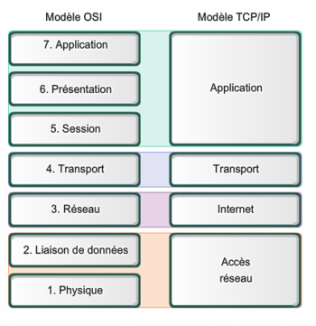

# B1 Réseau - Cours 6

* [Cisco](#cisco)
* [Modèle OSI]
* [DHCP]

## Cisco

Cisco est une entreprise dont le coeur de marché est la production et la vente de matériel et logiciel autour du réseau. Dominant largement le marché du réseau propriétaire, leur position s'affaisse un peu depuis quelques années avec l'arrivée de Huawei. Avec ~40% de parts de marché actuellement Cisco reste l'entreprise dominante.  

Leur gamme de produits réseau couvrent les principaux besoins, parmis lesquels :
* routeurs
* switches
* firewall
* AP WiFI

Cisco propose des certifications, la première étant la CCNA1.

## Modèle OSI
**Le modèle OSI est un modèle**. Comme tous les modèles (en informatique ou n'importe quel autre domaine), il ne représente pas la réalité, mais propose une façon de l'aborder.  

 

  

Le modèle OSI présente une façon d'organiser un trafic réseau, et de structurer les paquets qui y circulent en leur donnant du sens. C'est un système très analogue au système de courrier postal.  

**N'en ayez pas peur**, le but n'est pas de l'apprendre mais de le comprendre. Et votre compréhension du modèle OSI évoluera au fil de vos études/votre vie d'informaticien.  

Il se présente sous la forme de "couches" qui résulte en [l'encapsulation réseau](./5.md#le-principe-dencapsulation).  
On trouve à chaque couches certains protocoles. Le [protocole IP](../../lexique.md#ip--internet-protocol-v4) se trouve au niveau 3 par exemple.

Vous l'avez déjà vu à plusieurs endroits : 
* dans la [page lexique](../../cours.md#protocoles) du cours, les protocoles sont organisés par leur niveau dans le modèle OSI (et c'est désormais explicite)
* dans Wireshark, la donnée contenue dans chaque paquet est présenter sous la forme des couches du modèle OSI
* **quand je viens vous débug en cours** sur vos VMs CentOS 7
  * **d'abord je regarde le niveau 1**
    * l'interface graphique de virtualbox, la gestion des host-only :  "est-ce que t'as bien branché les câbles ?"
  * **ensuite niveau 2** : 
    * "tape `ip a` stp" : "est-ce que tes MACs sont bien différentes ?"
    * "tape `ip neigh show` : "est-ce que tu vois correctement tes voisins ?"
  * **niveau 3** : 
    * "refais `ip a` stp" : "est-ce que tes IPs sont dans le même réseau ?"
  * **niveau 4** : 
    * "fais un `ss` ou `netstat` stp" : "est-ce que t'as bien une application derrière le port en question ?"
    * "affiche ton firewall" : "est-ce que le port en question est bien autorisé ?"
  * **et accessoirement, à partir de 5 je peux vous demander** 
    * "t'es bien en sudo ou en root ?"
    * "t'as désactivé SELinux ?"

---

Un autre modèle pertinent est le modèle TCP/IP, souvent beaucoup plus utile pour travailler au quotidien. Il n'existe plus d'aspect physique, on ne raisonne qu'avec les couches au dessus de 1. Toutes les couches de données sont mutualisées. 

 

  

## DHCP
[DHCP](./lexique.md#dhcp--dynamic-host-configuration-protocol) est un protocole réseau permettant d'attribuer automatiquement (de façon "dynamique) des adresses IPs aux machines d'un réseau.  

Le protocole [DHCP](./lexique.md#dhcp--dynamic-host-configuration-protocol) est mis en place par une relation entre un serveur DHCP et des clients qui n'ont pas d'adresses IP, le tout sur un réseau donné.  

Lorsqu'un client arrive sur un réseau, il ne connaît ni la MAC ni l'IP du serveur DHCP. L'échange afin qu'il obtienne son ip se passe comme suit (c'est l'échange **DORA**) :  
**1. Discover**
  * un client rejoint un réseau (connexion à un réseau WiFi, ou par câble)
  * le client envoie un message en broadcast (à l'adresse MAC `ff:ff:ff:ff:ff:ff`)
  * ce message a pour but de découvrir le réseau à la recherche d'un serveur DHCP  
**2. Offer**
  * un serveur DHCP reçoit le **Discover**
  * il répond un message **Offer**
    * il contient l'IP du serveur DHCP
    * et une IP que le serveur propose au client  
**3. Request**
  * le client reçoit le message **Offer**
  * il répond au serveur un message **Request**
    * ceci a pour but de demander au serveur si, en effet, il peut prendre l'IP proposée
    * la présence de ce message est surtout utilisée à des fins de sécu, et afin de traiter le cas où plusieurs serveurs DHCP sont présents  
**4. Acknowledge**
  * le serveur reçoit le message **Request**
  * il répond un **Acknowledge** 
    * il valide l'attribution de l'IP au client
    * et il crée un **bail DHCP**
**5. Le client a une IP dans le bon réseau**

Un bail DHCP contient plusieurs informations :
* tel client possède actuellement telle adresse IP
  * les clients sont identifiés par leurs MAC
* date d'expiration

Enfin, un serveur DHCP permet aussi de distribuer d'autres informations, par exemple : 
* adresse de la passerelle du réseau
* adresse du serveur DNS du réseau