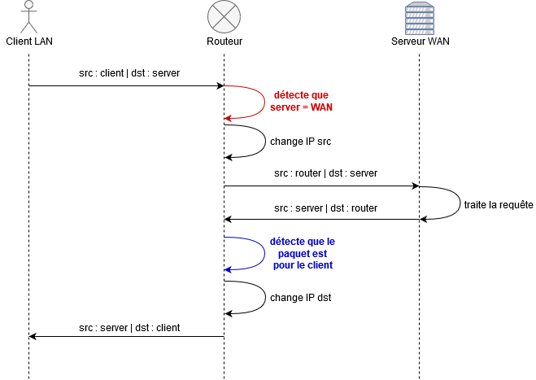

# B1 Réseau - Cours 7

* [I. OSPF](#i-ospf)
* [II. NAT](#ii-nat)

# I. OSPF

## 1. Intro 

OSPF pour *Open Shortest Path First* est une implémentation (un peu custom) de [l'algorithme de Dijkstra](https://fr.wikipedia.org/wiki/Algorithme_de_Dijkstra) (théorie des graphes). Cet algorithme est utilisé pour calculer le chemin le plus court entre un point A et un point B (aussi utilisé par les apps GPS).  

**OSPF est un protocole** de routage dynamique. La mise en place du protocole au sein d'un réseau avec plusieurs routeurs permettra la configuration du routage beaucoup plus aisée, **et surtout beaucoup plus stable et complètement dynamique**.  

Dans un réseau complexe avec plusieurs routeurs, il y a souvent plusieurs routes possibles pour aller à un chemin donné. **Le but du protocole OSPF est de calculer la route la plus courte pour une source et une destination données.**

Parfois un routeur fail, ou câble lâche, ou Zeus a foudroyé votre datacenter. **Le caractère "dynamique" réside en sa capacité à recalculer une autre route en cas de défaillance d'un lien.**

## 2. Concept du protocole OSPF

### Aires

OSPF répartit un réseau en *aires* (ou *area*).
* il y a **toujours** une area 0
  * c'est **l'aire de backbone**
  * le backbone est un réseau constitué uniquement d'équipements réseaux (firewall, switch, routeurs, etc.) qui achemine et filtre le trafic entre toutes les autres aires
  * toutes les autres aires sont connectées au backbone
* une aire est un domaine diffusion
  * c'est à dire qu'une requête en broadcast ne peut pas changer d'aire
* un découpage avec plusieurs aires est nécessaire quand on dépasse 50/100 routeurs, ça reste superflu avant ça, la quantité de message reste tolérable
  * *ui on en fait plus dans le TP, mais sinon ça a moins d'intérêt*
* on appelle ABR (area border router) les routeurs font la liaison entre deux aires

Il existe différent type d'aires, mais on verra ça plus tard. 

### Election d'un DR/BDR

Plutôt que de flooder le réseau en permanence pour échanger leurs routes, les routeurs vont élire un routeur désigné (DR) et un routeur désigné de backup (BDR). C'est eux qui seront à la charge d'apprendre les routes et de les distribuer. 

### Partage de route

Chaque routeur partage les routes qu'il connaît :
* les routes auxquelles il est directement connecté
  * toujours le même principe : si on a une IP, on a une route vers ce réseau
    * quand t'es chez toi, tu sais comment aller dans ta rue : c'est devant chez toi
* les routes saisies à la main
* les routes apprises par un autre protocole de routage

### Utilisation d'un ID unique

Chaque routeur possède un ID unique :
* il est sous la même forme qu'une adresse IP
  * `1.1.1.1` par exemple
  * **mais ce n'est PAS une adresse IP**
* par convention, et par respect pour vos collaborateurs bon dieu, si on le nomme à la main, on utilise un nom significatif 
  * comme `1.1.1.1` pour `router1`
* sinon il est choisi automatiquement en fonction d'une des IPs du routeur
  * les loopback de préférence
    * oui on peut créer des loopbacks de façon arbitraire
  * ou l'adresse IP la plus petite

[Pour le détail de la ligne de commande avec Cisco ça se passe ici.](./procedures-cisco.md#ospf)

# II. NAT

Tous les LANs qui vous permettent d'accéder à un WAN (Internet par exemple) dispose du NAT. Le NAT permet de faire la jonction entre un domaine d'adresses privées et un domaine d'adresses publiques. Vos box Internet font **forcément** du NAT.  

**Le NAT est un concept et ne fait référence à aucune technologie spécifique.** De la même façon que la seule action que fait un routeur c'est changer les en-têtes Ethernet (les adresses MAC src et dst), le NAT c'est changer les en-têtes IP (les adresses IP src et dst).  

**C'est forcément un routeur qui met en place du NAT**. Bah oui, une machine qui fait du NAT, c'est une machine qui est à la fois dans un domaine privé et un domaine public. Donc forcément dans deux réseaux, et il fait le lien entre les deux.  C'est la définition même du routeur.  

## Concrètement, pourquoi on a besoin du NAT ?

Prenons le cas suivant en exemple :
```
                                 Passerelle :
     Votre PC                 votre box/routeur            Serveur en ligne
+-----------------+          +-----------------+          +-----------------+
|                 |          |                 |          |                 |
|                 |          |                 |          |                 |
|                 |          |                 |          |                 |
|         10.1.1.1+--------->+10.1.1.254       |          |                 |
|                 |          |                 |          |                 |
|                 |          |      97.45.21.25+--------->+129.2.14.137     |
|                 |          |                 |          |                 |
|                 |          |                 |          |                 |
+-----------------+          +-----------------+          +-----------------+
```

Votre PC veut discuter avec un serveur en ligne. Il est dans un LAN (donc il possède une adresse privée), le serveur est dans un WAN (il possède une adresse publique) :
1. **Le PC crafte un paquet IP contenant sa donnée**
    * IP src : `10.1.1.1`
    * IP dst : `129.2.14.137`
2. **Le PC envoie ce paquet vers l'Internet**
    * pour le PC, "vers Internet" ça veut dire "vers la passerelle du réseau"
    * donc ici, le message part vers la MAC associée à l'IP `10.1.1.254`
    * `10.1.1.254` c'est la passerelle de la route par défaut du PC
    * `10.1.1.254` c'est la passerelle par défaut du PC
3. **Le routeur reçoit le paquet, et l'envoie à son tour vers Internet**
    * il peut le faire car il a une IP publique, qui permet de joindre le WAN (`97.45.21.25`)
    * et il a une route par défaut qui pointe vers cette interface
4. **Le serveur de destination reçoit la requête**
    * il la traite
5. **Le serveur de destination veut répondre**
    * il crafte un paquet de réponse
    * IP src : `129.2.14.137` 
    * IP dst : `10.1.1.1`
6. **Le serveur envoie ce paquet vers ?...**
    * bah vers nulle part
    * la destination, `10.1.1.1` est une adresse privée
    * le serveur étant dans un domaine public, il est strictement incapable de répondre à ce message

**Donc a un problème : nos messages peuvent sortir, mais ne peuvent pas revenir. NAT à la rescousse.**

## Concept du NAT 

Un client dans un [LAN](#lanwan) veut joindre un serveur dans un [WAN](#lanwan) :

<p align="center">
  
</p>

**Explication** :

1. **le client envoie sa requête**
    * IP source : client
    * IP destination : serveur WAN
2. **le routeur détecte que le paquet est à destination d'une IP publique** (sur le WAN)
    * parce qu'il voit que l'IP appartient à l aplage publique
3. **il va alors modifier l'IP source du paquet, pour mettre son IP publique**
    * il va aussi créer une ligne dans sa **Table NAT**
    * cette **Table NAT** contient une ligne pour chaque client LAN qui a voulu joindre un serveur WAN
4. la requête est acheminée jusqu'au serveur de destination
    * IP source : router
    * IP destination : serveur WAN
5. le serveur traite la requête
6. **il répond à la requête**
    * *il répond à celui qui lui a posé la question*
    * IP source : serveur WAN 
    * IP destination : router
7. **le routeur réceptionne la réponse**
    * **le routeur détecte que ce paquet n'est en fait pas pour lui, mais pour un client NAT**
    * il le détecte en regardant sa **Table NAT**
    * il voit que cette connexion correspond à un client
8. **le routeur va modifier l'IP de destination du paquet, pour qu'il arrive jusqu'au client**
9. **le message est envoyé au client**
    * IP source : serveur WAN 
    * IP destination : client
10. **Le client reçoit sa réponse normalement**

**Notez que l'opération est totalement transparente pour le client**. Son message revient comme il le devrait dans une communication normale : pour le message retout l'IP source est bien celle du serveur, celle de destination est bien la sienne.  

**Les clients, depuis un LAN, peuvent aller sur le WAN (Internet, entre autres) de façon totalement transparente, grâce au NAT.** Boom.

<p align="center">
  
</p>

> il existe deux RFCs au sujet du NAT est ça se lit plutôt bien si vous avez du temps à perdre : [1631](https://tools.ietf.org/html/rfc1631) et [2663](https://tools.ietf.org/html/rfc2663)
