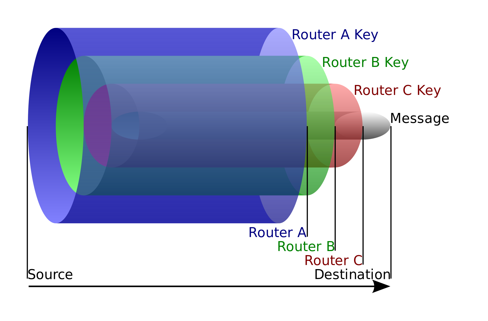

# Darknet / Deepweb

* [I. Pré-requis vocabularien](#i-pré-requis-vocabularien)
* [II. Deepweb](#ii-deepweb)
  * [0. On se met d'accord sur les mots](#0-on-se-met-daccord-sur-les-mots)
  * [1. Intro](#1-intro)
  * [2. Le projet Tor](#2-le-projet-tor)
  * [3. Pourquoi/quand utiliser un tel outil](#3-pourquoiquand-utiliser-un-tel-outil-)
  * [4. So, how does it actually work ?](#4-so-how-does-it-work-)
  * [5. Accéder à un service web avec tor](#5-accéder-à-un-service-web-avec-tor)
    * [Est-ce qu'on peut casser l'anonymat/le chiffrement ?](#ok-le-plus-important--comment-on-casse-tout-ça--passons-en-revue-les-différents-positions-possibles-pour-un-attaquant) (spoiler alert : moyennant beaucoup d'efforts, oui)
  * [6. Hidden service](#6-hidden-services)
  
* [III. Darkweb]

# I. Pré-requis vocabularien
*Effectivement, le titre ne veut rien dire.*

Avant d'entrée dans le vif du sujet, il est **primordial** qu'on définisse clairement plusieurs termes : 
* WAN
* Internet
* Web

### WAN

Le [WAN](../lexique.md#wan--wide-area-network) (*Wide Area Network*) désigne un réseau global, étendu. Celui qu'on utilise le plus souvent est Internet, mais il peut en exister d'autres. 

Le mot *WAN* désigne un concept, mais aucun réseau en particulier.

### Internet

Internet correspond, comme son nom l'indique, au réseau entre les réseaux (inter-network). Comment ça t'aide pas ?  

Internet désigne :
* le réseau physique (niveau 1 du modèle OSI)
  * c'est ça :

<br><p align="center">
  
</p>

* l'ensemble des [routeurs](../lexique.md#routeur), créant une sorte de toile permettant d'acheminer des messages
  * qui dit [routeur](../lexique.md#routeur) ...
    * dit [adresse MAC](#mac--media-access-control) et protocole [Ethernet](../lexique.md#ethernet) (niveau 2 du modèle OSI) 
    * et dit aussi adresse [IP](../lexique.md#ip--internet-protocol-v4) et [protocole IP](../lexique.md#ip--internet-protocol-v4) (niveau 3 du modèle OSI)

> Ca vous fait pas déjà bizarre de voir écrit adresse avec un seul d en français ? Y'a que moi que ça perturbe ?

**Donc Internet, c'est des routeurs et des câbles. Plein de câbles. Et pas mal de routeurs aussi. Mais surtout des câbles.**

### Web

Le Web c'est un réseau qui vit en se servant d'Internet comme base, comme support. il est "posé" par dessus Internet. Le Web, c'est un ensemble de serveurs, reliés à Internet, qui hébergent des sites Web. Derrière un site Web, il y a un serveur HTTP (qui écoute traditionnellement sur le port 80/tcp (`http`) et|ou 443/tcp (`https`)).  

Donc le Web :
* des serveurs HTTP reliés entre eux grâce à Internet
* ils écoutent sur un port (niveau 4 du modèle OSI) et parle HTTP (couche applicative du modèle OSI, au dessus de 4)
* on visite des serveurs web avec des clients web 
  * ou "navigateurs web"
  * mais pas que. Je pense pas qu'on puisse qualifier `curl` de "navigateur web"

Le Web c'est le truc cool pour échanger de l'info à travers le monde entier, avec un langage commun : HTTP, et un réseau pour acheminr nos requêtes. 

:fire: !  

Mais pas tout le temps :fire: en fait...  

Mais avant ça, parlons du Deepweb.

---

# II. Deepweb

**Le Deepweb, vous le visitez tous les jours.** Le Deepweb, c'est juste les pages du Web non-référencées dans des index connus, comme les moteurs de recherche. Liste non-exhaustive de pages dans le Deepweb :
* votre fil d'actu facebook
  * faut être connecté pour le voir, il est généré de façon unique pour chaque individu en fonction de données à un instant T (donc impossible de le prédire à priori), aucun moteur de recherche n'y a accès pour le référencer
* n'importe quel page de "Profil" de n'importe quel site
  * idem, faut se login pour voir ça, Google peut pas voir ça
* en fait, n'importe quelle page de n'importe quel site qui nécessite d'être connecté
* en fait, à peu près 99,999...% du Web.
  * tu lances un serveur HTTP sur ton laptop ? Techniquement, deepweb.

**Donc on est pas venus là pour parler de ça.**

---

# III. Darknet / Darkweb

## 0. On se met d'accord sur les mots

Alors darknet ou darkweb ? J'sais pas c'est sujet à débat : 
* "dark" 
  * wait what ? Google Chrome c'est dark pour moi, mais le "darknet/web" n'a rien de dark, on va voir ça...

* "web" ou "net" ?
  * "net" : c'est un réseau, au sens large du terme, donc pourquoi pas "net"
  * "web" : le "darknet/web" c'est une alternative au [Web](#web) défini plus haut. **Pas à Internet**. Donc on préférera "web" pour la suite du document. 

## 1. Intro

Le **Darkweb** c'est : 
* un réseau alternatif au réseau Web
* un moyen alternatif pour se connecter au Web
  * en passant par le réseau alternatif avant d'accéder au Web

Souvent, quand on parle du Darkweb, on parle de [tor](https://www.torproject.org/) (de la même façon que quand on parle du WAN on parle génériquement d'Internet). 

## 2. Le projet Tor

Le mot "tor" désigne :
* un projet qui est l'initiative qui a mené à la création du "réseau tor"
* un outil, permettant de se connecter au "réseau tor"
  * par exemple le [tor browser](https://www.torproject.org/projects/torbrowser.html.en)
  * téléchargez-le
  * nan sans déc, téléchargez-le
  * **téléchargez-le, vous êtes des informaticiens**
* un réseau, le réseau tor
  * c'est un réseau distribué
    * c'est à dire qu'il est réparti à travers plusieurs zones et que chaque machine du réseau fonctionne de concert avec les autres afin de servir un but commun
  * il est composé de serveurs appelés *"tor relays"* (relais tor)
  * c'est juste des serveurs (souvent Linux), avec `tor` installé et configuré pour agir comme "relais"
  * tous les relais sont maintenus en vie **bénévolement** de façon libre et transparente
    * [info et liste des relais ici](https://metrics.torproject.org/networksize.html)
    * [map des relais en temps réel ici](https://torflow.uncharted.software/)
      * ça c'est une vraie appli web (code dispo sur github)

[La page d'accueil du Tor Project en parle mieux que moi, go on.](https://www.torproject.org/)  

Le but du Projet Tor est de fournir une alternative pour accéder au Web, ou de façon générale une alternative pour échanger des infos à travers Internet (*on est d'accord, visiter un site web c'est "échanger des infos"*). Une alternative qui :
* garantit une meilleure **confidentialité**
  * confidentialité = un message reste secret entre un expéditeur et un destinatire
  * confidentialité = seul le destinataire d'un message peut le lire
* garantit une anonymisation forte
* garantit un respect global de l'utilisateur
  * basé sur des outils libres et open-source essentiellement développés par des indépendants

Euh, juste. Un réseau public, avec des outils ouverts, une cryptographie connue de tous... qui garantit confidentialité, respect et anonymisation forte ?

<br><p align="center">
  
</p>

---

## 3. Pourquoi/quand utiliser un tel outil ?

**Les cas d'utilisation parfaitement légitimes sont nombreux :**
* visite d'un site d'achat/un site bancaire depuis un WiFi public
* journalistes de guerre
* habitants d'un pays qui restreint l'accès à l'information globale
* cacher des choses ?... mais ça peut être légitime parfois aussi. Exemple : tu bosses dans une boîte, trkl. Boum, pose déj. Tu prends 10 min peinard avant d'aller manger et tu visites deux trois sites : facebook, machin, gnagna, ET ton site de rencontre gay. Bon bah techniquement, quelqu'un qui sniffe le réseau (ou juste... l'admin réseau ?) sait que tu viens de faire ça. **Il connaît pas le contenu du message, juste sa source et sa destination. Mais c'est déjà suffisant** pour tirer des conclusions. Et peut-être que tu le fais régulièrement. Et peut-être que t'as pas envie d'être viré parce que ton patron est homophobe.
* et d'innombrables autres. De façon générale, j'm'inscrirais à une télé-réalité si j'voulais que mes moindres faits et gestes soient publics

---

## 4. So, how does it work ?

On a plein de serveurs, ils sont connectés, on est biens. Comment on se sert du bail maintenant ? Plusieurs possibilités : 
* on accède à un service Web à travers le réseau tor
  * avec le Tor Browser par exemple
* on accède à un "hidden service" tor
  * avec le Tor Browser
* d'autres types d'utilisation moins courantes (mais techniquement on peut faire passer un paquet de trucs par tor)

### Concept de Onion routing

> Le principe nous vient à l'origine de l'armée US il y a un bail maintenant.

Le principe de l'onion routing est d'utiliser des machines intermédiaires afin d'acheminer un message. Chaque machine n'a connaissance que de ses voisins lors d'une communication.

```
  PC          Relais 1     Relais 2     Relais 3      Web Server
+----+         +----+       +----+       +----+         +----+
|    |         |    |       |    |       |    |         |    |
|    +---------+    | +-----+    +-------+    +---------+    |
+----+         +----+       +----+       +----+         +----+
```

Plusieurs procédés cryptographiques ont lieu ici. Le coeur du processus se déroule comme suit :
* PC génère 3 clés (asymétriques souvent, mais peu important pour l'exemple au final)
  * appelons-les `k1` `k2` et `k3`
* il les distribue comme suit : 

```
  PC          Relais 1     Relais 2     Relais 3      Web Server
+----+         +----+       +----+       +----+         +----+
|    |         |    |       |    |       |    |         |    |
|    +---------+    | +-----+    +-------+    +---------+    |
+----+         +----+       +----+       +----+         +----+
  k1             k1           k2           k3
  k2
  k3
```
* pour envoyer un message vers le serveur, PC va chiffrer trois fois successivement son message avant de l'envoyer :
  * on aura trois "couches" de chiffrement
  * des couches comme dans un oignon

<br><p align="center">
  
</p>

* ce message arrive sur le relais1, il enlève la première couche
* puis sur relais2, il enlève la couche
* puis sur relais3, il enlève la couche
* puis sur le serveur avec la donnée initiale

Anonymat et confidentialité : 
* aucun des relais, à part le dernier n'a pu voir la donnée
  * qui elle-même peut être chiffrée (http**s** par exemple)
* seul le dernier des relais connaît la destination
* seul le premier relais connaît la source (le PC)
  * **le serveur de destination ne connaît pas le PC**
* un chiffrement fort a été utilisé de bout en bout au sein du réseau tor

> N'oubliez pas que ça se pose "dessus" Internet, ou n'importe quel réseau. Donc on peut toujours avoir un acheminement des messages classique en dessous. Des routeurs et des switches quoi, qui amènent les messages aux différents relais/serveurs, comme dans nos TPs. 

---

## 5. Accéder à un service Web avec Tor

Izi : ouvrir tor browser, se connecter à google.com. 'oilà. Faites-le, la suite aura plus de sens.  

A gauche de la barre d'URL, cliquez (là où il y a le cadenas vert d'habitude), pour obtenir la liste des serveurs intermédiaires par lesquels votre requête est passée avant d'atteindre la destination. **Le réseau tor utilise trois relais pour chaque connexion, on appelle ces trois relais un "circuit tor".**

#### Ok le plus important : comment on casse tout ça ? Passons en revue les différents positions possibles pour un attaquant. 

### A. Dans le réseau tor

Par exemple : le hacker est un membre de la communauté tor qui héberge un relai.

```
                      hacker
                       +---+
                       |   |
                       +-+-+
                         |
                         |
                         |
  PC          Relais 1   | Relais 2     Relais 3      Web Server
+----+         +----+    |  +----+       +----+         +----+
|    |         |    |    |  |    |       |    |         |    |
|    +---------+    | +--+--+    +-------+    +---------+    |
+----+         +----+       +----+       +----+         +----+
```

**Mmmmh ça sert à rien strictement à rien**. De loin la pire position. Tout est complètement chiffré. Le réseau tor découpe tous les messages en taille égale (512 octets), donc tout ce qu'on voit c'est des paquets qui font tous la même taille, rempli de texte chiffré, qui vont d'un relai à un autre.  

Littéralement aucune info à part "y'a des trucs".

### B. Côté client

Par exemple : le hacker est connecté au même WiFi public que vous (gare, cybercafé, restaurants, etc.)

```
       hacker
        +---+
        |   |
        +-+-+
          |
  PC      |   Relais 1     Relais 2     Relais 3      Web Server
+----+    |    +----+       +----+       +----+         +----+
|    |    |    |    |       |    |       |    |         |    |
|    +----+----+    | +-----+    +-------+    +---------+    |
+----+         +----+       +----+       +----+         +----+
```

Ici pas grand chose encore. Le hacker sait que "PC" utilise tor. Mais c'est tout. Pas d'accès ni au contenu, **ni à la destination** des messages. 

### C. Côté serveur

Par exemple : le hacker est un employé malveillant chez facebook.com, ou sur le dernier relai tor

```
                                               hacker
                                                +---+
                                                |   |
                                                +-+-+
                                                  |
                                                  |
  PC          Relais 1     Relais 2     Relais 3  |   Web Server
+----+         +----+       +----+       +----+   |     +----+
|    |         |    |       |    |       |    |   |     |    |
|    +---------+    | +-----+    +-------+    +---+-----+    |
+----+         +----+       +----+       +----+         +----+
```

Pas grand chose toujours. Le hacker sait quel serveur est visité grâce au réseau tor mais ignore la source du message. Quelques précisions ici :
* suivant le site visité, s'il y a des noms et prénoms publics ce genre de chose, bon bah c'est cramé hein, il aura pas ton IP, mais il aura ton nom. :|
  * qui visite `jeanmicheldelaforetdesbois.com` à part la personne concernée ?
  * le nom de domaine (fictif) au dessus peut vous paraître débile mais petit aparté, moins fictif, mais relativement basique :
    * imaginons un domaine PAS cramé du genre `webradio.online.com`
    * j'suis un hacker, je vois qu'une requête sort vers ce site
    * "tiens c'est quoi ce site, allons-voir" (en plus si on peut écouter du son j'suis cho)
    * tiens c'est un "site perso" et y'a une authentification
    * il a appartient à qui ce nom de domaine ? Ha. A tel gars. Ok.
    * Ha et c'est lui aussi le fondateur du site ? Et l'adresse mail de contact ?
  * encore un exemple ? Des tas d'app font passer des noms d'utilisateurs ou ce genre de trucs dans l'URL des requêtes passées. Bon bah si c'est ton nom et ton prénom...
  * **mais ça reste des exemples très minoritaires et isolés**

* si la connexion au site est `https` (chiffrée avec TLS) **le contenu du message est toujours chiffré, ça change pas ça** okay ?

Donc toujours pas ouf, on a pas le contenu des messages, pas plus que côté client. On connaît le site de destination, c'est plus utile que le côté client pour détecter certaines choses, mais c'est dans des cas très minoritaire. **On connaît ne pas la source du message.**

### D. Côté client + serveur

Par exemple : honnêtement ? Un mec qui en veut vraiment :
* il faudrait qu'il possède deux noeuds tor parmi les trois choisis aléatoirement dans votre communication (celui d'entrée et de sortie)
* ou qu'il possède celui de sortie et soit dans le café à côté de vous :|
* ou qu'il soit dans le café à côté de vous ET avec un VPN dans le réseau de facebook :|
  * c'est "NSA-feasible" :| mais très peu probable

```
              hacker                                  hacker
               +---+                                   +---+
               |   |                                   |   |
               +---+                                   +---+
                 |                                       |
                 |                                       |
         PC      |   Relais 1     Relais 2     Relais 3  |   Web Server
       +----+    |    +----+       +----+       +----+   |     +----+
       |    |    |    |    |       |    |       |    |   |     |    |
       |    +---------+    | +-----+    +-------+    +---------+    |
       +----+         +----+       +----+       +----+         +----+
```

**Bon c'est relou à mettre en place maiiiis ça paye**. 
* On a toujours deux tas d'infos (côté client d'une part et côté serveur d'autre part) qui donne pas trop d'infos
* Mais on peut réussir (moyennant BEAUCOUP de travail, et des techniques comme l'analyse de fréquence) à corréler les deux flux d'informations afin de déterminer qui a visité quoi et **faire complètement tomber l'anonymat.**
* Si le site visité est en HTTP**S**, le contenu du message est toujours chiffré

#### E. We need a fix Houston

Bon on a un problème. Moyennant effort, quelqu'un de mal-intentionné (et de très organisé/chanceux) peut contourner les mécanismes mis en place pour faire tomber l'anonymat. C'est extrêmement coûteux, mais c'est possible.  

C'est suffisant pour avoir besoin d'une solution afin de disposer de services garantissant un anonymat total. 

**Le concept est simple, on va éliminer purement et simplement la position "côté serveur"**. La communication à travers tor passe par au sein du réseau tor, avant de resortir sur le web. Petit schéma.  

On va passer de ça :
```
                 +---------------------------+
                 |                           |
                 |                           |
                 |        Réseau tor         |
  PC             |                           |        Web Server
+----+           |                           |          +----+
|    |           |                           |          |    |
|    +-----------+                           +----------+    |
+----+           |                           |          +----+
                 |                           |
                 |                           |
                 |                           |
                 |                           |
                 +---------------------------+
```

A ça :
```
                 +---------------------------+
                 |                           |
                 |                           |
                 |        Réseau tor         |
  PC             |                           |
+----+           |                           |
|    |           |                           |
|    +-----------+  Web Server               |
+----+           |    +----+                 |
                 |    |    | jsuis ds le dark|
                 |    |    | net lol         |
                 |    +----+                 |
                 |                           |
                 +---------------------------+

```

**Et maintenant, ce serveur, il s'appelle un "hidden service", et l'adresse pour le joindre sera sous la forme `<HASH>.onion`.**

---

## 6. Hidden services

Un Hidden Service est donc un service, par exemple un serveur web, qui est au sein du réseau tor.  

Rien de magique ici, avec un peu de détails :
* faire tourner un service classique
  * un serveur web NGINX par exemple
* installer `tor`
* configurer `tor` et lui dire "hé, j'ai un service là frer"
* lancer tor
  * les échanges cryptographiques sont réalisés
  * le serveur choisit des I.P. (introduction points) qui permettront de joindre un hidden service hébergé... quelque part
  * tor génère une adresse en `.onion` qui rend le serveur accessible avec un client tor
* utiliser un client tor (tor browser) pour visiter le site
  * le client doit connaître l'adresse onion pour visiter le site
  * l'adresse onion permet au client de savoir comme arriver aux I.P. choisis par le serveur
  * le client décide d'un "point de rendez-vous" où le client et le serveur vont se retrouver pour discuter
* le client et le serveur discutent en créant tous les deux un circuit tor

Sans détails :
* faire tourner un service classique
  * un serveur web NGINX par exemple
* install + conf tor
* **le client peut visiter le service en `.onion` et il est garant d'un anonymat TRES fort et d'un chiffrement total de bout en bout**

:fire: :fire: :fire: :fire:

**Et tout ça sans qu'aucun des noeuds intermédiaires ne soit au courant de quoique ce soit. Si c'est pas trop stylé techniquement parlant, je sais pas ce que c'est.**

---

> Bon, on en parle du nom ? Je propose Lightweb plutôt. C'est moins marketing mais plus proche de la réalité.