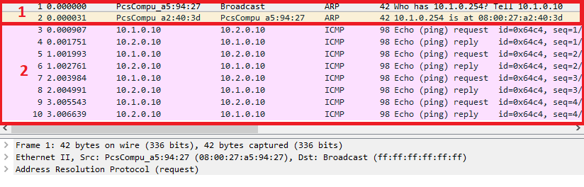
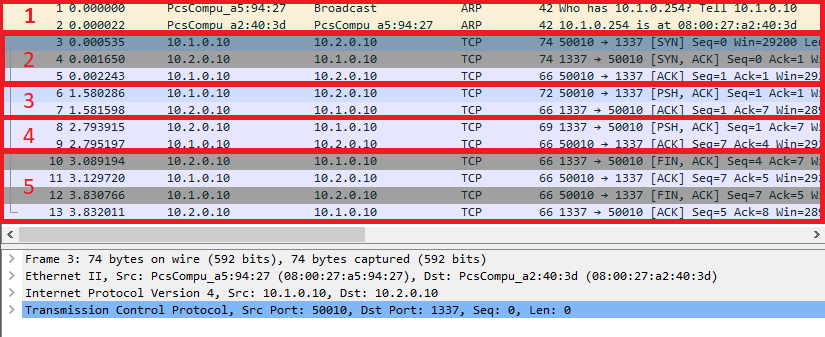
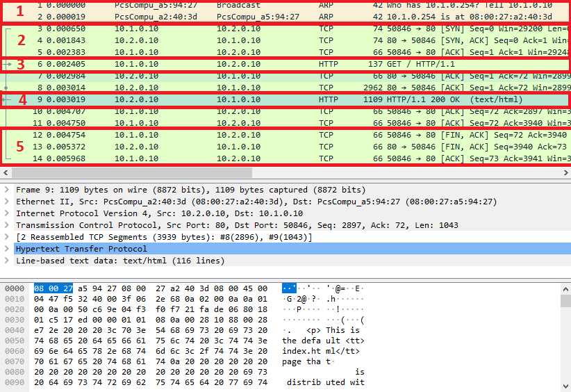

# TP4 - Correction - Spéléologie Réseau

* [I. Mise en place du lab](#i-mise-en-place-du-lab)
* [II. Spéléo réso](#ii-spéléo-réso)
  * [1. ARP](#1-arp)
    * [Manip 1](#manip-1)
    * [Manip 2](#manip-2)
    * [Manip 3](#manip-3)
    * [Manip 4](#manip-4)
  * [2. Wireshark](#2-wireshark)
    * [A. `ping`](#a-ping)
    * [B. `netcat`](#b-netcat)
    * [C. `HTTP`](#c-http)

# I. Mise en place du lab

La mise en place du lab est entièrement automatisée grâce à Vagrant :

* Liste des machines actives :  

```bash
[it4@it4 tp4]$ vagrant status
Current machine states:
router1                   running (virtualbox)
client1                   running (virtualbox)
server1                   running (virtualbox)
```

* Etat de `client1.tp4.b1` :

```bash
[it4@it4 tp4]$ vagrant ssh client1
Last login: Mon Feb  4 17:29:48 2019 from 10.0.2.2

[vagrant@client1 ~]$ ip a
3: eth1: <BROADCAST,MULTICAST,UP,LOWER_UP> mtu 1500 qdisc pfifo_fast state UP group default qlen 1000
    link/ether 08:00:27:a5:94:27 brd ff:ff:ff:ff:ff:ff
    inet 10.1.0.10/24 brd 10.1.0.255 scope global noprefixroute eth1
       valid_lft forever preferred_lft forever
    inet6 fe80::a00:27ff:fea5:9427/64 scope link 
       valid_lft forever preferred_lft forever

[vagrant@client1 ~]$ ip r s
default via 10.1.0.254 dev eth1 
10.1.0.0/24 dev eth1 proto kernel scope link src 10.1.0.10 metric 101 
10.2.0.0/24 via 10.1.0.254 dev eth1 

[vagrant@client1 ~]$ cat /etc/hosts
127.0.0.1   localhost localhost.localdomain localhost4 localhost4.localdomain4
10.1.0.10 client1 client1.tp4.b1
10.1.0.254 router1 router1.tp4.b1
10.2.0.10 server1 server1.tp4.b1

[vagrant@client1 ~]$ ping server1.tp4.b1
64 bytes from server1 (10.2.0.10): icmp_seq=1 ttl=63 time=1.16 ms
64 bytes from server1 (10.2.0.10): icmp_seq=2 ttl=63 time=2.08 ms

[vagrant@client1 ~]$ traceroute server1.tp4.b1
traceroute to server1.tp4.b1 (10.2.0.10), 30 hops max, 60 byte packets
 1  router1 (10.1.0.254)  0.787 ms  0.727 ms  0.711 ms
 2  server1 (10.2.0.10)  1.308 ms !X  1.312 ms !X  1.300 ms !X

```

* Etat de `server1.tp4.b1`

```bash
[it4@it4 tp4]$ vagrant ssh server1
Last login: Fri Feb  8 13:37:54 2019 from 10.0.2.2

[vagrant@server1 ~]$ ip a
3: eth1: <BROADCAST,MULTICAST,UP,LOWER_UP> mtu 1500 qdisc pfifo_fast state UP group default qlen 1000
    link/ether 08:00:27:85:65:4a brd ff:ff:ff:ff:ff:ff
    inet 10.2.0.10/24 brd 10.2.0.255 scope global noprefixroute eth1
       valid_lft forever preferred_lft forever
    inet6 fe80::a00:27ff:fe85:654a/64 scope link 
       valid_lft forever preferred_lft forever

[vagrant@server1 ~]$ ip r s
default via 10.2.0.254 dev eth1 
10.1.0.0/24 via 10.2.0.254 dev eth1 
10.2.0.0/24 dev eth1 proto kernel scope link src 10.2.0.10 metric 100 

[vagrant@server1 ~]$ cat /etc/hosts
127.0.0.1   localhost localhost.localdomain localhost4 localhost4.localdomain4
10.1.0.10 client1 client1.tp4.b1
10.2.0.254 router1 router1.tp4.b1
10.2.0.10 server1 server1.tp4.b1

[vagrant@server1 ~]$ ping client1.tp4.b1
PING client1 (10.1.0.10) 56(84) bytes of data.
64 bytes from client1 (10.1.0.10): icmp_seq=1 ttl=63 time=1.91 ms
64 bytes from client1 (10.1.0.10): icmp_seq=2 ttl=63 time=1.98 ms

[vagrant@server1 ~]$ traceroute client1.tp4.b1
traceroute to client1.tp4.b1 (10.1.0.10), 30 hops max, 60 byte packets
 1  router1 (10.2.0.254)  1.309 ms  1.061 ms  0.975 ms
 2  client1 (10.1.0.10)  1.504 ms  1.448 ms  1.361 ms
```

* Etat de `router1.tp4.b1`

```bash
[it4@it4 tp4]$ vagrant ssh router1
Last login: Fri Feb  8 13:45:46 2019 from 10.0.2.2

[vagrant@router1 ~]$ ip a
3: eth1: <BROADCAST,MULTICAST,UP,LOWER_UP> mtu 1500 qdisc pfifo_fast state UP group default qlen 1000
    link/ether 08:00:27:a2:40:3d brd ff:ff:ff:ff:ff:ff
    inet 10.1.0.254/24 brd 10.1.0.255 scope global noprefixroute eth1
       valid_lft forever preferred_lft forever
    inet6 fe80::a00:27ff:fea2:403d/64 scope link 
       valid_lft forever preferred_lft forever
4: eth2: <BROADCAST,MULTICAST,UP,LOWER_UP> mtu 1500 qdisc pfifo_fast state UP group default qlen 1000
    link/ether 08:00:27:b2:bc:8e brd ff:ff:ff:ff:ff:ff
    inet 10.2.0.254/24 brd 10.2.0.255 scope global noprefixroute eth2
       valid_lft forever preferred_lft forever
    inet6 fe80::a00:27ff:feb2:bc8e/64 scope link 
       valid_lft forever preferred_lft forever

[vagrant@router1 ~]$ ip n s
10.2.0.10 dev eth2 lladdr 08:00:27:85:65:4a STALE
10.1.0.10 dev eth1 lladdr 08:00:27:a5:94:27 STALE

[vagrant@router1 ~]$ ip r s
10.1.0.0/24 dev eth1 proto kernel scope link src 10.1.0.254 metric 101 
10.2.0.0/24 dev eth2 proto kernel scope link src 10.2.0.254 metric 102 
```

---

**Tableau récapitulatif :**

Machine | `net1` | `net2`
--- | --- | ---
`client1.tp4` | **`10.1.0.10`** / `08:00:27:a5:94:27` | X
`router1.tp4` | **`10.1.0.254`** / `08:00:27:a2:40:3d` | **`10.2.0.254`** / `08:00:27:b2:bc:8e`
`server1.tp4` | X | **`10.2.0.10`** / `08:00:27:85:65:4a` 

---

# II. Spéléo réso
## 1. ARP
### Manip 1

* sur `client1`
```bash
[vagrant@client1 ~]$ sudo ip neigh flush all
[vagrant@client1 ~]$ ip n s
10.0.2.2 dev eth0 lladdr 52:54:00:12:35:02 REACHABLE
```

* sur `server1`
```bash
[vagrant@server1 ~]$ sudo ip neigh flush all
[vagrant@server1 ~]$ ip n s
10.0.2.2 dev eth0 lladdr 52:54:00:12:35:02 REACHABLE
```

* La seule ligne présente dans les deux cas correspond à notre machine hôte. En effet la machine hôte et la VM communique en permanence parce qu'on utilise SSH pour se connecter à la machine. La machine hôte et la VM ont donc du s'échanger leurs adresses MAC. 

> Les IPs utilisées par `vagrant` sont légèrement différentes des vôtres pendant le TP. Le principe reste le même.

* sur `client1` :
```bash
[vagrant@client1 ~]$ sudo ip neigh flush all
[vagrant@client1 ~]$ ip n s
10.0.2.2 dev eth0 lladdr 52:54:00:12:35:02 REACHABLE

[vagrant@client1 ~]$ ping server1
PING server1 (10.2.0.10) 56(84) bytes of data.
64 bytes from server1 (10.2.0.10): icmp_seq=1 ttl=63 time=1.88 ms
64 bytes from server1 (10.2.0.10): icmp_seq=2 ttl=63 time=1.95 ms

[vagrant@client1 ~]$ ip n s
10.0.2.2 dev eth0 lladdr 52:54:00:12:35:02 REACHABLE
10.1.0.254 dev eth1 lladdr 08:00:27:a2:40:3d REACHABLE
```

* une nouvelle ligne est apparue : `10.1.0.254 dev eth1 lladdr 08:00:27:a2:40:3d REACHABLE`
  * **avec un coup d'oeil à notre tableau du dessus, on s'aperçoit que c'est bien la MAC de `router1` qui vient d'apparaître**
  * pour discuter avec `server1`, notre client passe par le routeur et doit donc connaître sa MAC

---

### Manip 2

* sur `router1`

```bash
[vagrant@router1 ~]$ sudo ip n  flush all
[vagrant@router1 ~]$ ip n s
10.0.2.2 dev eth0 lladdr 52:54:00:12:35:02 REACHABLE
```

* La seule ligne présente dans les deux cas correspond à notre machine hôte. En effet la machine hôte et la VM communique en permanence parce qu'on utilise SSH pour se connecter à la machine. La machine hôte et la VM ont donc du s'échanger leurs adresses MAC. 

> Les IPs utilisées par `vagrant` sont légèrement différentes des vôtres pendant le TP. Le principe reste le même.

* sur `client1`
```bash
[vagrant@client1 ~]$ ping server1
PING server1 (10.2.0.10) 56(84) bytes of data.
64 bytes from server1 (10.2.0.10): icmp_seq=1 ttl=63 time=1.87 ms
64 bytes from server1 (10.2.0.10): icmp_seq=2 ttl=63 time=1.89 ms
```

* sur `router1` :
```bash
[vagrant@router1 ~]$ ip n s
10.2.0.10 dev eth2 lladdr 08:00:27:85:65:4a REACHABLE
10.1.0.10 dev eth1 lladdr 08:00:27:a5:94:27 REACHABLE
10.0.2.2 dev eth0 lladdr 52:54:00:12:35:02 REACHABLE
```

* **notre routeur a enregistré les MAC de `server1` et `client1`**
  * il a du effectuer un ARP broadcast pour cela
  * car seule la MAC des machines leur permet de discuter

---

### Manip 3

* **GNU/Linux**
```bash
[it4@it4 ~]$ date
Fri Feb  8 15:02:28 CET 2019
[it4@it4 ~]$ sudo ip n flush all
[it4@it4 ~]$ ip n s 
[it4@it4 ~]$ 

[it4@it4 ~]$ date
Fri Feb  8 15:02:35 CET 2019
[it4@it4 ~]$ ip n s
[it4@it4 ~]$ 

[it4@it4 ~]$ date
Fri Feb  8 15:02:39 CET 2019
[it4@it4 ~]$ ip n s
[it4@it4 ~]$ 

[it4@it4 ~]$ date 
Fri Feb  8 15:02:44 CET 2019
[it4@it4 ~]$ 
[it4@it4 ~]$ ip n s
192.168.1.1 dev wlo1 lladdr 78:94:b4:de:fd:c4 REACHABLE
```

* **Windows**
```
PS C:\WINDOWS\system32> date
vendredi 8 février 2019 16:04:11

PS C:\WINDOWS\system32> arp -a
Interface : 192.168.1.29 --- 0x9
  Adresse Internet      Adresse physique      Type
  192.168.1.1           78-94-b4-de-fd-c4     dynamique
  224.0.0.22            01-00-5e-00-00-16     statique

PS C:\WINDOWS\system32> netsh interface ip delete arpcache
Ok.

PS C:\WINDOWS\system32> arp -a
Interface : 192.168.1.29 --- 0x9
  Adresse Internet      Adresse physique      Type
  224.0.0.22            01-00-5e-00-00-16     statique

PS C:\WINDOWS\system32> date
vendredi 8 février 2019 16:04:25

PS C:\WINDOWS\system32> arp -a
Interface : 192.168.1.29 --- 0x9
  Adresse Internet      Adresse physique      Type
  224.0.0.22            01-00-5e-00-00-16     statique

PS C:\WINDOWS\system32> date
vendredi 8 février 2019 16:04:29

PS C:\WINDOWS\system32> arp -a
Interface : 192.168.1.29 --- 0x9
  Adresse Internet      Adresse physique      Type
  192.168.1.1           78-94-b4-de-fd-c4     dynamique
  224.0.0.22            01-00-5e-00-00-16     statique
```

* **c'est la passerelle de mon réseau WiFI (la box de chez moi) qui est revenue**
  * notre PC effectue régulièrement des requêtes broadcast vers ses passerelles par défaut
  * pour vérifier que c'est bien ma passerelle par défaut (sur mon Linux):

```bash
[it4@it4 ~]$ ip route show
default via 192.168.1.1 dev wlo1 proto dhcp metric 600 
10.1.0.0/24 dev vboxnet9 proto kernel scope link src 10.1.0.1 
10.2.0.0/24 dev vboxnet10 proto kernel scope link src 10.2.0.1 
172.17.0.0/16 dev docker0 proto kernel scope link src 172.17.0.1 linkdown 
192.168.1.0/24 dev wlo1 proto kernel scope link src 192.168.1.15 metric 600 
```

> on voit aussi bien les deux réseaux vbox :)

---

### Manip 4

* sur `client1`

```bash
[vagrant@client1 ~]$ ip neigh flush all
[vagrant@client1 ~]$ ip neigh show

# Allumage de la carte NAT
[vagrant@client1 ~]$ ifup eth2

[vagrant@client1 ~]$ curl -L google.com
# Shit load of html

[vagrant@client1 ~]$ ip neigh show
10.0.2.2 dev enp0s3 lladdr 52:54:00:12:35:02 REACHABLE
```

* la nouvelle entrée dans la table ARP correspond à la machine qui nous a permis d'aller sur internet (sur `google.com`)
  * **c'est donc forcément notre machine hôte qui porte cette IP**
  * c'est ce que fait le NAT de VirtualBox : il permet à la VM de passer par l'hôte pour aller sur internet

---

## 2. Wireshark

### A. `ping`

* sur `router1`

```bash
[vagrant@router1 ~]$ sudo tcpdump -i eth1 -w ping.pcap
tcpdump: listening on eth1, link-type EN10MB (Ethernet), capture size 262144 bytes
^C10 packets captured
10 packets received by filter
0 packets dropped by kernel
```

> 10 paquets capturés : c'est OK ! (4 ping, 4 pong, 1 ARP request en broadcast, 1 ARP reply)

* pendant que, sur `client1`

```bash
[vagrant@client1 ~]$ ping -c 4 server1
PING server1 (10.2.0.10) 56(84) bytes of data.
64 bytes from server1 (10.2.0.10): icmp_seq=1 ttl=63 time=2.48 ms
64 bytes from server1 (10.2.0.10): icmp_seq=2 ttl=63 time=1.58 ms
64 bytes from server1 (10.2.0.10): icmp_seq=3 ttl=63 time=2.07 ms
64 bytes from server1 (10.2.0.10): icmp_seq=4 ttl=63 time=2.21 ms
```

* sur cette capture, on voit `client1` et `router1` discuter
  * en effet, on ne capture le trafic que sur une seule interface du routeur
  * donc on ne voit que les trames qui passent par cette interface
  * on manque ainsi la moitié du trafic : celui entre `router1` et `server1` (l'autre interface du routeur)
  * il en sera de même sur toutes les autres captures

---

* explication de l'échange

<p align="center">
  
</p>

**1. ARP Broadcast et Reply**
  * trame n°1 : `client1` demande la MAC de la passerelle (c'est `router1`)
  * trame n°2 : `router1` répond à `client1` en indiquant sa MAC

**2. Echange de ping/pong**
  * alternativement on observe les ping et pong entre `client1` et `server1`
  * le protocole utilisé par `ping` est ICMP
  * la MAC de destination de tous les messages ICMP envoyé par `client1` est celle de `router1`
    * car tous les messages passent par `router1` avant d'arriver à `server1`

---

### B. `netcat`

* préparation sur `server1`
```bash
[vagrant@server1 ~]$ sudo firewall-cmd --add-port=1337/tcp --permanent
susuccess
[vagrant@server1 ~]$ sudo firewall-cmd --reload
success
[vagrant@server1 ~]$ nc -l 1337

```

* connexion avec `client1`
```bash
[vagrant@client1 ~]$ nc server1 1337
```

* échange de message

* pendant que `router1` intercepte et enregistre le trafic
```bash
[vagrant@router1 ~]$ sudo tcpdump -i eth1 -w netcat.pcap
tcpdump: listening on eth1, link-type EN10MB (Ethernet), capture size 262144 bytes
^C13 packets captured
13 packets received by filter
0 packets dropped by kernel
```

---

* [fichier de capture `netcat.pcap` au TP](./pcap/netcat.pcap)

* explication de l'échange

<p align="center">
  
</p>

**1. ARP Broadcast et ARP Reply**
  * trame n°1 : `client1` demande la MAC de la passerelle (c'est `router1`)
  * trame n°2 : `router1` répond à `client1` en indiquant sa MAC

**2. c'est le 3-way handshake au niveau TCP (pareil que pour `netcat`)**
  * le trafic HTTP a besoin d'une connexion TCP
  * trame n°3 : `SYN` : `client1` demande une connexion au serveur
  * trame n°4 : `SYN, ACK` : `server1` accepte et valide la connexion
  * trame n°5 : `ACK` : le client valide la connexion

**3. C'est la donnée envoyée par client vers serveur**
  * trame n°6 : donnée envoyée par `client1`
  * trame n°7 : `server1` valide la donnée reçu (accusé de réception)
  * j'ai juste envoyé "hello"

**3. C'est la donnée envoyée par `server1` vers le client**
  * trame n°8 : donnée envoyée par `server1`
  * trame n°9 : `client1` valide la donnée reçu (accusé de réception)
  * j'ai juste envoyé "hi"

**5. `client1` et `server1` quittent la connexion**
  * `client1` et `server1` échange des `FIN,ACK` -> `ACK` pour terminer la connexion

---

### C. `HTTP`

* sur `server1`
```
[vagrant@server1 ~]$ sudo systemctl start nginx
```

* sur `client1`
```bash
[vagrant@client1 ~]$ sudo ip n flush all
[vagrant@client1 ~]$ curl server1
# shit load of HTML
```

* pendant que, sur `router1`
```bash
[vagrant@router1 ~]$ sudo tcpdump -i eth1 -w http.pcap
tcpdump: listening on eth1, link-type EN10MB (Ethernet), capture size 262144 bytes
^C14 packets captured
14 packets received by filter
0 packets dropped by kernel
```

---

* [fichier de capture `http.pcap` au TP](./pcap/http.pcap)  

* explication de l'échange :

<p align="center">
  
</p>


**1. ARP Broadcast et ARP Reply**
  * trame n°1 : `client1` demande la MAC de la passerelle (c'est `router1`)
  * trame n°2 : `router1` répond à `client1` en indiquant sa MAC

**2. c'est le 3-way handshake au niveau TCP (pareil que pour `netcat`)**
  * le trafic HTTP a besoin d'une connexion TCP
  * trame n°3 : `SYN` : le client demande une connexion au serveur
  * trame n°4 : `SYN, ACK` : le serveur accepte et valide la connexion
  * trame n°5 : `ACK` : le client valide la connexion

**3. C'est la requête HTTP du client**
  * trame n°6 : requête HTTP du client
  * il demande la page qui se trouve à `/`
  * par défaut ce sera le `index.html` qui lui sera retourné

**4. Réponse HTTP du serveur**
  * trame n°9 : réponse HTTP du serveur
  * il répond une trame qui contient le `index.html`
  * le code `HTTP 200` signifie que la requête s'est bien passée

**5. Le client quitte la connexion**
  * trame n°12 : `FIN,ACK` : le client demande à terminer la connexion
  * trame n°13 : `FIN,ACK` : le serveur valide la fermeture de la connexion
  * trame n°14 : `ACK` : le client valide la fermeture de la connexion

---

:fire: :fire: :fire: