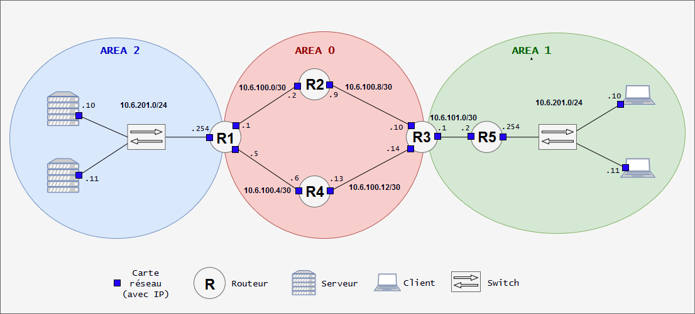

# B1 Réseau 2018 - TP6

# Notions vues avant le TP

* Manipulations IP et masque (avec le [binaire](../../cours/lexique.md#binaire))
* Notions :
  * Firewall
  * Routage (statique)
  * IP, Ports, MAC
* Utilisation de CentOS
  * installation simple
  * utilisation CLI simple (cf [les commandes du Lexique](../../cours/lexique.md#commandes))
    * `man`, `cd`, `ls`, `nano`, `cat`
    * `ip a`, `ping`, `nc`, `traceroute`, `ss`
  * configuration réseau (voir la fiche de [procédures](../../cours/procedures.md))
    * configuration d'[interfaces](../../cours/lexique.md#carte-réseau-ou-interface-réseau)
    * gestion simplifié de nom de domaine
      * [hostname, FQDN](../../cours/procedures.md#changer-son-nom-de-domaine), fichier [`/etc/hosts`](../../cours/procedures.md#editer-le-fichier-hosts)
* Concepts
    * configuration [firewall](../../cours/lexique.md#pare-feu-ou-firewall)
    * configuration routage statique ([TP 3](../3/README.md))
    * table [ARP](../../cours/5.md#arp) ou table de voisinnage ([TP4](../4/README.md)) 
* [Utilisation basique de routeurs Cisco](../../cours/procedures-cisco.md)


# TP 6 - Une topologie qui ressemble un peu à quelque chose, enfin ? 

Dans ce TP on va construire une topologie qui ressemble presque à une vraie topologie. A petite échelle tout de même. 

Au menu :
* on va enfin aborder le **routage dynamique**
  * parce que saisir des routes à la main c'est chiant !
  * *"chiant"* ça veut dire : long, fastidieux, **et donc, terrain propice à l'erreur humaine**
* on va utiliser le protocole de routage **OSPF**
  * de la façon la plus simple possible
* nous configurerons nous-mêmes **un routeur qui fait du NAT**
  * ou presque
  * pour que les clients accèdent à internet
* il y aura **un serveur DHCP dans le réseau des clients**
  * pour distribuer les infos nécessaires aux clients
  * IP, adresse de gateway
* il y aura **un réseau dédié aux serveurs**
  * un serveur a une IP fixe, pas de DHCP ici donc
  * un serveur au moins fera tourner un serveur web (ou un `netcat`)
* **les clients pourront joindre le réseau de serveurs et internet**
* en bonus : 
  * mettre en place un serveur DNS
    * comme ça, tout sera fait maison : routage, adressage IP, DNS, DHCP, NAT ! Boom.
  * approfondir OSPF
    * jouer avec authentification, coûts, loopback interfaces, etc.
  * utilisation de switch Cisco + mise en place de VLAN

# Déroulement et rendu du TP 
* vous aurez besoin de : 
  * [Virtualbox](https://www.virtualbox.org/wiki/Downloads)
  * [GNS3](https://www.gns3.com/)

* les machines virtuelles Linux : 
  * l'OS **devra être** [CentOS 7 (en version minimale)](http://isoredirect.centos.org/centos/7/isos/x86_64/CentOS-7-x86_64-Minimal-1810.iso)
  * pas d'interface graphique (que de la ligne de commande)
  
* les routeurs Cisco :
  * l'iOS devra être celui d'un [Cisco 3640](https://drive.google.com/drive/folders/1DFe2u5tZldL_y_UYm32ZbmT0cIfgQM2p)

* les switches :
  * devront être de bêtes "Ethernet Switch" dans GNS3
  * peut-être qu'on utilisera de l'iOU si jamais certains d'entre vous avancent vite (switch Cisco)

* il y a beaucoup de ligne de commande dans ce TP, préférez les copier/coller aux screens

* le rendu doit toujours se faire [au même format](../README.md)

# Hints généraux
* **pour vos recherches Google** (ou autres) : 
  * **en anglais**
  * **précisez l'OS et la version** dans vos recherches ("centos 7" ici)
* dans le TP, **lisez en entier une partie avant de commencer à la réaliser.** Ca donne du sens et aide à la compréhension
* **allez à votre rythme.** Le but n'est pas de finir le TP, mais plutôt de bien saisir et correctement appréhender les différentes notions
* **n'hésitez pas à me demander de l'aide régulièrement** mais essayez toujours de chercher un peu par vous-mêmes avant :)
* pour moult raisons, il sera préférable pendant les cours de réseau de **désactiver votre firewall**. Vous comprendrez ces raisons au fur et à mesure du déroulement du cours très justement. N'oubliez pas de le réactiver après coup.
* **utilisez SSH dès que possible** pour les VMs (pas les routeurs)

# Sommaire
* [Lab 1 : Simple OSPF](#lab-1--simple-ospf)
* [Lab 2 : Un peu de complexité (et d'utilité ?)](#lab-2--un-peu-de-complexité-et-dutilité-)
  * [1. Présentation du lab et contexte](#1-présentation-du-lab-et-contexte)
    * [Schéma de la topologie](#schéma-de-la-topologie)
    * [Aires OSPF](#aires-ospf)
    * [Réseaux IP et aires OSPF](#réseaux-ip-et-aires-ospf)
    * [Adressage IP des machines](#adressage-ip-de-chacune-des-machines)
  * [2. Mise en place du lab](#2-mise-en-place-du-lab)
    * [Adressage statique - routeurs](#checklist-ip-routeurs)
    * [Adressage statique - VMs](#checklist-vms)
    * [OSPF](#configuration-de-ospf)
* [Lab 3 : Let's end this properly](#lab-3--lets-end-this-properly)
  * [NAT (accès internet dans tout le réseau)](#1-nat--accès-internet)
  * [Un service d'infra](#2-un-service-dinfra)
  * [DHCP (adressage dynamique pour les clients)](#3-serveur-dhcp)
  * [DNS](#4-serveur-dns)
  * [NTP (synchronisation de l'heure)](#5-serveur-ntp)


# Lab 1 : Simple OSPF

Petit lab simple pour comprendre le concept. 


# Lab 2 : Un peu de complexité (et d'utilité ?...)

**Pour mettre en place une topologie intéressante, on a pas beaucoup d'autres choix que d'augmenter grandement le nombre de routeurs/machines. Par "augmenter grandement" je parle relativement à ce qu'on a fait jusqu'à maintenant.**   

Ca reste minuscule comparé à de vrais réseaux. Le lab tourne sans problème sur mon PC pas si ouf du tout. (il a ~5 ans, i5-4200m, 8gb RAM DDR3, HDD 7200tr/min sata3).

---

## 1. Présentation du lab et contexte

Allons-yyyyy ! Je pense que les schémas moches ont atteint leur limite. Paix à leur âme :( . Topologie pour ce lab 2 : 

<p align="center">
  
</p>

---

### Aires OSPF 

OSPF met en place des *area* ou *aires*. C'est principalement utilisé pour faire *scale* l'infrastructure (augmenter sa taille) sans flood le réseau.  

Nous allons nous servir des *aires* OSPF pour distinguer : 
* une aire "backbone" 
  * c'est l'`area 0`
  * toutes les autres y sont connectées
    * donc tout trafic qui change d'aire passe forcément par celle-ci
  * le WAN (~= internet) est souvent accessible depuis l'aire "backbone"
* une aire pour les services d'infrastructures
  * ce sera l'`area 1`
  * dans un cas réel on peut trouver tout un tas de trucs ici, beaucoup de services internes
  * nous on aura un p'tit serveur web ou un `netcat` simple, pour simuler un service un service disponible
* une aire pour les clients
  * ce sera l'`area 2`
  * X clients seront ajoutés
  * leur adressage IP et leur table de routage seront gérées automatiquement
    * présence d'un serveur DHCP

### Réseaux IP et aires OSPF

Dans chacune des aires OSPF se trouveront des réseaux IP. Un bon vieux tableau pour ça (tout ça est sur le schéma).

Réseaux | `area 0` | `area 1` | `area 2` | Commentaire
--- | --- | --- | --- | ---
`10.6.100.0/30` | X | - | - | Liaison entre `r1` et `r2`
`10.6.100.4/30` | X | - | - | Liaison entre `r1` et `r4`
`10.6.100.8/30` | X | - | - | Liaison entre `r2` et `r3` 
`10.6.100.12/30` | X | - | - | Liaison entre `r3` et `r4`
`10.6.101.0/30` | - | X | - | Liaison entre `r3` et `r5`
`10.6.201.0/24` | - | X | - | Réseau des clients
`10.6.202.0/24` | - | - | X | Réseau des serveurs

### Adressage IP de chacune des machines

Machines | `10.6.100.0/30` | `10.6.100.4/30` | `10.6.100.8/30` | `10.6.100.12/30` | `10.6.101.0/30` | `10.6.201.0/24` | `10.6.202.0/24`
--- | --- | --- | --- | --- | --- | --- | --- 
`r1.tp6.b1` | `10.6.100.1` | `10.6.100.5` | - | - | - | - | `10.6.202.254`
`r2.tp6.b1` | `10.6.100.2` | - |  `10.6.100.9` | - | - | - | -
`r3.tp6.b1` | - | - | `10.6.100.10` | `10.6.100.12` | `10.6.101.1` | - | -
`r4.tp6.b1` | - |  `10.6.100.6` | - | `10.6.100.13` | - | - | -
`r5.tp6.b1` | - | - | - | - |  `10.6.101.2` |  `10.6.201.254` | -
`client1.tp6.b1` | - | - | - | - | - |  `10.6.201.10` | -
`client2.tp6.b1` | - | - | - | - | - |  `10.6.201.11` | -
`server1.tp6.b1` | - | - | - | - | - | - | `10.6.202.10`

## 2. Mise en place du lab

### Checklist IP Routeurs 

On parle de `r1.tp6.b1`, `r2.tp6.b1`, `r3.tp6.b1`, `r4.tp6.b1` et `r5.tp6.b1` :
* [ ] [Définition des IPs statiques](../../cours/procedures-cisco.md#définir-une-ip-statique)
* [ ] [Définition du nom de domaine](../../cours/procedures-cisco.md#changer-son-nom-de-domaine)

### Checklist VMs

On parle de `client1.tp6.b1`, `client2.tp6.b1` et `server1.tp6.b1` :
* [X] Désactiver SELinux
  * déja fait dans le patron
* [X] Installation de certains paquets réseau
  * déja fait dans le patron
* [ ] Enlever la carte NAT
  * utiliser uniquement la carte de GNS3
  * si vous voulez, configurez une host-only pour faire du SSH (recommandé)
* [ ] [Définition des IPs statiques](../../cours/procedures.md#définir-une-ip-statique)
  * il y a eu un edit dans la procédure pour préciser directement une passerelle :)
  * **DONC précisez la passerelle directement dans le fichier de configuration**
  * après y'aura un DHCP ;)
* [ ] [Définition du nom de domaine](../../cours/procedures.md#changer-son-nom-de-domaine)
* remplir [les fichiers `hosts`](../../cours/procedures.md#editer-le-fichier-hosts)
  * mettez juste les clients et les serveurs
  * **PAS** les routeurs (parce que... ça sert à rien ?)

### Vérifier que tout ça fonctionne
* en utilisant des `ping` un peu dans tous les sens
* pas besoin de me mettre cette étape dans le compte-rendu, ça prendra forme dans l'étape suivante

### [Configuration de OSPF](../../cours/procedures-cisco.md#OSPF)

Ca se passe sur les routeurs uniquement. On parle de `r1.tp6.b1`, `r2.tp6.b1`, `r3.tp6.b1`, `r4.tp6.b1` et `r5.tp6.b1` :
* [ ] [activation de OSPF](../../cours/procedures-cisco.md#OSPF)
* [ ] [configurer le `router-id`](../../cours/procedures-cisco.md#OSPF)
  * chez nous ce sera le numéro du routeur répété 4 fois
  * par exemple pour `r1` : `1.1.1.1`
* [ ] [configurer les routes à partager](../../cours/procedures-cisco.md#OSPF)
  * simple : partagez tout les réseaux auxquels vous êtes directement connectés
  * par exemple : 
    * `r1.tp6.b1` doit partager `10.6.100.0/30`, `10.6.100.4/30` et `10.6.202.0/24`

* pour vérifier que ça fonctionne
  * `show ip route`
    * devrait montrer des routes qui commencent par `O` comme OSPF :)
  * `show ip protocols`
    * devrait montrer un process `ospf` qui tourne
  * `show ip ospf neighbor`
    * devrait montrer les voisins OSPF pour chacun des routeurs
  * et surtout, des `ping` !
    * vérifier par exemple que `r1.tp6.b1` peut `ping r5.tp6.b1`
    * mieux : `client1.tp6.b1` vers `server1.tp6.b1`
      * si vous avez bien set la `GATEWAY` (voir checklist VM), ça devrait passer direct
  * ou mieux : `traceroute` !
    * ça existe aussi sur Cisco (mais je le trouve un peu moche)

# Lab 3 : Let's end this properly

Le Lab 3 c'est le Lab 2 mais avec les deux trois trucs qui manquent pour les clients : 
* du NAT
  * pour accéder à internet
* un service sur lequel taper en interne
  * petit serveur web ou `netcat`
* un serveur DHCP
  * pour récupérer une IP et une route par défaut automatiquement
* un serveur DNS ? (bonus)
  * pour avoir une résolution de nom en local
* un serveur NTP ? (bonus)
  * pour avoir l'heure synchronisée en local
  * comme mentionné en cours : c'ets **très important** et pas si trivial que ça

Qui porte quel service ? Pour qui est ce service ? Pourquoie ?

Service | Qui porte le service ? | Pour qui ? | Pourquoi ? 
--- | --- | --- | ---
NAT | `r4.tp6.b1` | tout le monde (routeurs & VMs) | Le NAT permet d'accéder à l'extérieur, il permet de sortir du LAN. Toutes les machines peuvent en avoir besoin dans notre petite infra
Serveur Web | `server1.tp6.b1` | réseau client `10.6.201.0/24` | Le serveur Web symbolise un service d'infra en interne. Dispo pour nos clients. Plus de détails dans la section dédiée.
DHCP | `client2.tp6.b1` | réseau client `10.6.201.0/24` | Le DHCP (qui permet d'attribuer des IPs automatiquement) c'est pour des clients. Pas pour des serveurs. Un serveur, on veut qu'il ait une IP fixe. 
DNS | `server1.tp6.b1` | tout le monde (routeurs & VMs) | Le DNS nous permettra de résoudre les noms de domaines en local et nous passer du fichier `/etc/hosts`
NTP | `server1.tp6.b1` | réseau serveur `10.6.202.0/24` | Le NTP, qui permet la synchronisation de l'heure, est souvent indispensable pourdes serveurs mais totalement négligeable pour des clients (genre vos PCs, s'ils sont pas à l'heure, tout le monde s'en fout)

**Avec tout ça, on a un petit réseau propre, carré, et (presque) autonome !**

---

## 1. NAT : accès internet
**On va mettre en place du NAT pour que toutes nos machines puissent accéder à Internet.**   
Bah oui, sinon nous faudrait une IP publique, et j'ai pas de quoi vous en donner une chacun, encore moins le matos pour porter ces IPs !  

Vous allez me détester : [**il faut la GNS3 VM**](https://docs.gns3.com/1Bn-s1Izkjp13HxcPF4b8QSGfkWJYG_dpMt9U1DQjvZ4/index.html) pour ça
* suivez le lien pour avoir les détails de l'install pour ceux qui ne l'ont pas
* après mise en place, il faut l'activer dans GNS3
  * Edit > Preferences > GNS3 VM > Enable (c'est une case à cocher)
  * puis redémarrer GNS3, la GNS3 Vm devrait boot toute seule
  * **aucune configuration sur la GNS3 VM n'est requise**

---

Une fois la GNS3 VM allumée et votre lab 2 ouvert là où vous l'aviez laissé :
* cherchez l'appareil "NAT" dans la liste des devices de GNS3
  * c'est un pitit nuage
  * drag'n'drop dans la topologie, mettez le en dessous de `r4.tp6.b1`

Faites en sorte d'avoir ça :

<p align="center">
  
</p>

* `r4.tp6.b1` va donc nous servir de "machine-pivot" pour permettre à tout le monde d'accéder à internet
  * `r4.tp6.b1` va faire du NAT
* d'abord, configuration IP : 
```
r4.tp6.b1# show ip int br

# repérez l'interface qui est branché au NAT. Dans la suite nous supposerons que c'est fastEthernet 0/0. Elle n'a pas encore d'IP.

r4.tp6.b1# conf t
r4.tp6.b1(config)# interface fastEthernet 0/0
r4.tp6.b1(config-if)# ip address dhcp
r4.tp6.b1(config-if)# no shut

# c'est le principe du NAT dans GNS3 : vous allez récupérer une IP automatiquement, et la machine sera capable de faire du NAT. 

# attendez un peu (ou spammez la commande) puis :
r4.tp6.b1# show ip int br

# vous devriez avoir récup une IP, et vous devriez ping google, grâce à votre nouvelle passerelle par défaut

# pour voir la passerelle
r4.tp6.b1# show ip route

# ping google
r4.tp6.b1# ping 8.8.8.8
```
* et configuration du NAT
```
r4.tp6.b1# conf t
r4.tp6.b1(config)# interface fastEthernet 0/0
r4.tp6.b1(config-if)# ip nat outside
r4.tp6.b1(config-if)# exit

r4.tp6.b1(config)# interface fastEthernet 1/0
r4.tp6.b1(config-if)# ip nat inside
r4.tp6.b1(config-if)# exit

r4.tp6.b1(config)# interface fastEthernet 2/0
r4.tp6.b1(config-if)# ip nat inside
r4.tp6.b1(config-if)# exit

# les commandes parlent d'elles-même : on définit quelles interface sont à l'intérieur du réseau, et laquelle point vers l'extérieur

# ensuite : 

r4.tp6.b1# conf t
r4.tp6.b1(config)# ip nat inside source list 1 interface fastEthernet 0/0 overload
r4.tp6.b1(config)# access-list 1 permit any

# ces deux commandes seront expliquées en détails plus tard (ou demandez-moi)

# maintenant que le NAT fonctionne, il faut partager la route par défaut à tout le monde. C'est désactivé par défaut sur nos routeurs :
r4.tp6.b1# conf t
r4.tp6.b1(config)# router ospf 1
r4.tp6.b1(config-router)# default-information originate
```

Pour vérifier que ça marche ? Simple : 
* tous les routeurs doivent avoir une passerelle par défaut normalement
  * `show ip route` pour le voir
* toutes les machines du réseau peuvent `ping 8.8.8.8`
  * si vous êtes à YNOV, testez avec `curl google.com` depuis les VM, comme d'hab
  * ou depuis les routeurs :
    * on peut utiliser les serveurs DNS de google
    * faire une requête Web à la main vers un serveur web full HTTP (pas de HTTPS)
```
r1.tp6.b1# conf t

# Activation du lookup DNS
r1.tp6.b1(config)# ip domain-lookup

# Configuration du serveur DNS (celui de google)
r1.tp6.b1(config)# ip name-server 8.8.8.8

# Requête web vers un site full HTTP, avec résolution de nom
r1.tp6.b1(config)# exit
r1.tp6.b1# telnet trip-hop.net 80
GET /

# Vous devriez récup de l'HTML en masse
```

:fire: :fire: :fire: 

---

## 2. Un service d'infra
Dans un cas réel, on peut héberger tout un tas de services utiles à tout le monde :
* partage de fichiers
* serveur de visioconférence
* serveur de mail
* serveur de chat
* hébergement de documentation
* dépôts git internes
* etc.

Pour simuler ça, on va mettre en place un simple serveur web avec une page d'accueil moche. 

Sur la machine `server1.tp6.b1` :
* si tout se passe bien, elle peut `ping google.com` (ou `curl` si vous êtes à YNOV)
```
# S'assurer que le firewall est démarré
sudo systemctl status firewalld
sudo systemctl start firewalld

# Ajouter une règle pour le trafic web
sudo firewall-cmd --add-port=80/tcp --permanent
sudo firewall-cmd --reload

# Installation du serveur web
sudo yum install -y epel-release
sudo yum install -y nginx

# Lancement du serveur web
sudo systemctl start nginx

# (facultatif) Si vous voulez personnaliser la super page d'accueil 
sudo nano /usr/share/nginx/html/index.html

# S'assurer que le serveur fonctionne et répond
curl localhost
```

Sur la machine `client1.tp6.b1` :
* en admettant que vous avez rempli son fichier [le fichier `hosts`](../../cours/procedures.md#editer-le-fichier-hosts)
* `curl server1.tp6.b1`  

:fire: :fire: :fire:

---

## 3. Serveur DHCP

Le serveur DHCP, c'est pour le réseau des clients : `10.6.201.0/24`. Pour économiser des ressources, on va recycler `client2.tp6.b1` en `dhcp.tp6.b1` :
* renommer la machine
* récupérer [le fichier `dhcpd.conf` du TP précédent](../5/dhcp/dhcpd.conf) dans la VM
  * **n'oubliez pas de changer les IPs dans le fichier `dhcpd.conf`** pour que ça colle avec ce TP
* puis :
```
# Installation du serveur DHCP
sudo yum install -y dhcp

# Remplir le fichier /etc/dhcp/dhcpd.conf avec l'exemple

# Démarrer le serveur DHCP
sudo systemctl start dhcpd

# Faire en sorte que le serveur DHCP démarre au boot de la machine
sudo systemctl enable dhcpd
```

Faire un test
* avec une nouvelle VM ou `client1.tp5.b1`
  * [configurer l'interface en DHCP, en dynamique (pas en statique)](../../cours/procedures.md#définir-une-ip-dynamique-dhcp)
  * et/ou utiliser [`dhclient`](../../cours/lexique.md#dhclient-linux-only)
* dans un cas comme dans l'autre, vous devriez récupérer une IP dans la plage d'IP définie dans `dhcpd.conf`

--- 

## 4. Serveur DNS

Le DNS, c'est un service d'infra, alors c'est côté réseau des serveurs (`10.6.202.0/24`). On va le mettre sur notre `server1.tp6.b1`.  

### Présentation

Le DNS va nous permettre d'arrêter de remplir nos fichiers `/etc/hosts` :| . Pour ça, on va mettre en palce un **serveur DNS**, qui sera chargé de :
* stocker toutes les infos liées aux noms de domaine de l'infra
  * quelles IP associée à quel nom de domaine
  * et réciproquement
* servir à des clients un service DNS
  * on peut lui demander pour résoudre des IP vers noms de domaine
  * ou réciproquement

### Mise en place

Sur `server1.tp6.b1` : 
  * les fichiers nécessaires sont dans le dossier [./dns/](./dns)
```
# Installation du serveur DNS
sudo yum install -y bind*

# Edition du fichier de configuration (voir fichier exemples dans ./dns/)
sudo vi /etc/named.conf

# Edition des fichiers de zone (voir fichiers exemples dans ./dns/)
sudo vi /var/named/forward.tp6.b1
sudo vi /var/named/reverse.tp6.b1

# Ouvrir les ports firewall concernés
sudo firewall-cmd --add-port=53/tcp --permanent
sudo firewall-cmd --add-port=53/udp --permanent
sudo firewall-cmd --reload

# Démarrage du service DNS
sudo systemctl start named

# Faire en sorte que le service démarre au boot de la VM
sudo systemctl enable named
```

Pour tester :
* depuis `server1.tp6.b1` lui-même, ou n'importe quelle machine Linux qui peut le joindre (les clients)
  * **APRES avoir vider le fichier /etc/hosts de ce que vous y aviez mis avant**
```
# Remplir le fichier /etc/resolv.conf pour mettre l'IP de notre nouveau DNS :)
echo "nameserver 10.6.202.10" | sudo tee /etc/resolv.conf

# On peut lui poser des questions avec la commande dig maintenant

# A quelle IP correspond "server1.tp6.b1" ?
dig server1.tp6.b1

# A quelle IP correspond "client2.tp6.b1" ?
dig client2.tp6.b1

# A quel nom de domaine correspond l'IP 10.6.201.10 ?
dig -x 10.6.201.10

# Ou tout simplement
ping client2.tp6.b1
```

* on peut aussi filer un serveur DNS au routeur Cisco, je vous laisse trouver ça avec votre moteur de recherché préféré !

---

## 5. Serveur NTP

Idem ici, NTP, c'est du service d'infra pour nos serveurs ! Alors ce sera sur `server1.tp6.b1` encore.  

Tout ça serait sur plusieurs machines dans un cas réel. Rien ne vous empêche d'en créer d'autres pour tester si votre machine vous le permet.

### Présentation

NTP (pour *Network Time Protocol*) est le protocole (= la langue) que l'on utilise pour permettr eà plusieurs serveurs d'être synchronisés au niveau de la date et de l'heure. Le problème est loin d'être trivial lorsque l'on s'y intéresse de près.  

Il existe des [serveurs NTP publics](https://www.pool.ntp.org), sur lesquels n'importe qui peut se synchroniser. Ils servent souvent de référence.  

Dans notre cas :
* on va demander à `server1.tp6.b1` de se synchroniser sur un serveur externe
* et on va demander à toutes les autres machines clientes de se synchroniser sur `server1.tp6.b1`

Dernier détail : sur CentOS, le service qui gère NTP s'appelle `chrony` :
* le démon systemd s'appelle `chronyd`
  * donc `sudo systemctl restart chronyd` par exemple
* la commande pour avoir des infos est `chronyc`
  * `chronyc sources` pour voir les serveurs pris en compte par `cronyd`
  * `chronyc tracking` pour voir l'état de la synchronisation
* la configuration se trouve dans `/etc/chrony.conf`
* présent par défaut sur CentOS

### Mise en place

Sur `server1.tp6.b1` : 
* éditer le fichier `/etc/chrony.conf`
  * [un contenu modèle se trouve ici](./chrony/serveur/chrony.conf)
  * choisissez le pool de serveurs français sur [le site des serveurs externes de référence](https://www.pool.ntp.org) et ajoutez le à la configuration
* [ouvrir le port utilisé par NTP](../../cours/procedures.md#interagir-avec-le-firewall)
  * c'est le port 123/UDP
* démarrer le service `chronyd`
  * `sudo systemctl start chronyd`
* vérifier l'état de la synchronisation NTP
  * `chronyc sources`
  * `chronyc tracking`

Sur toutes les autres machines : 
* éditer le fichier `/etc/chrony.conf`
  * [un contenu modèle se trouve ici](./chrony/client/chrony.conf)
* [ouvrir le port utilisé par NTP](../../cours/procedures.md#interagir-avec-le-firewall)
  * c'est le port 123/UDP
* démarrer le service `chronyd`
  * `sudo systemctl start chronyd`
* vérifier l'état de la synchronisation NTP

---